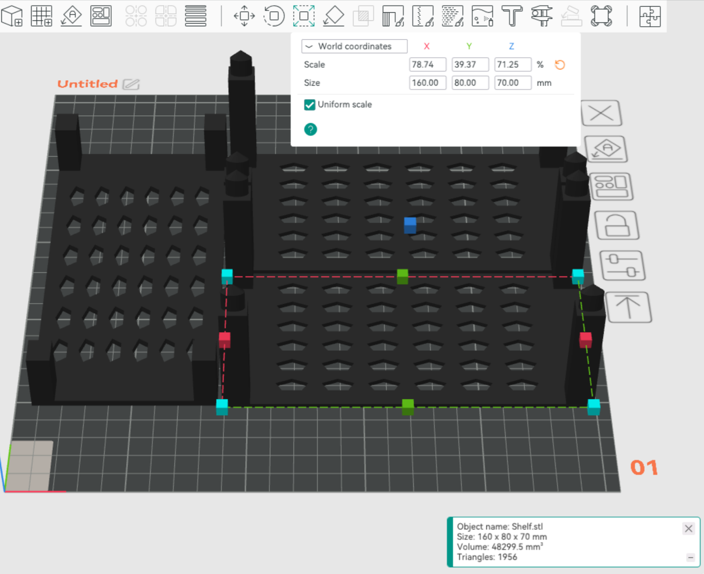
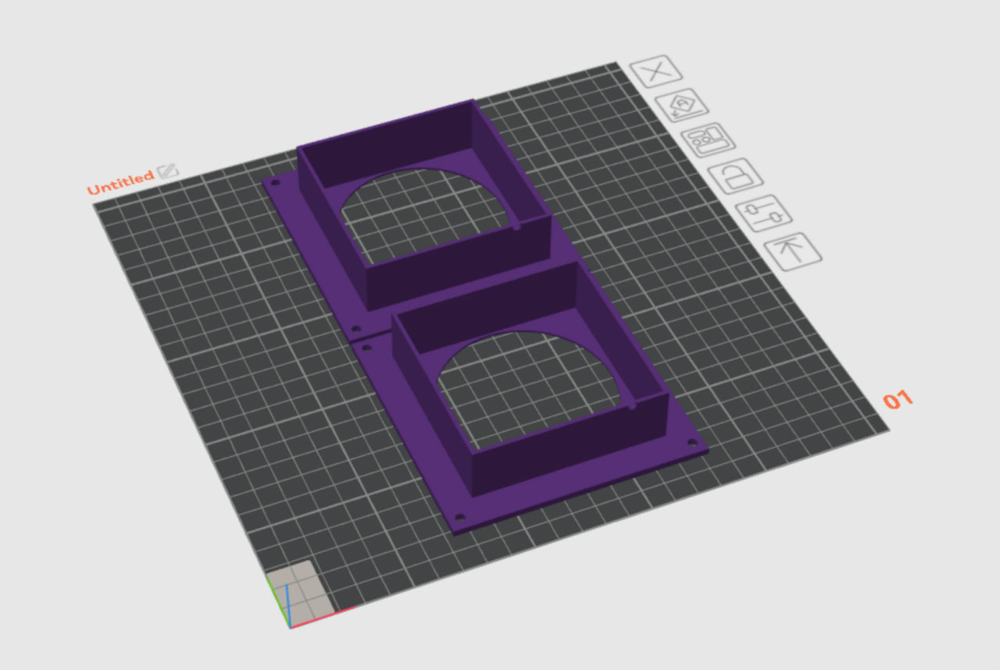
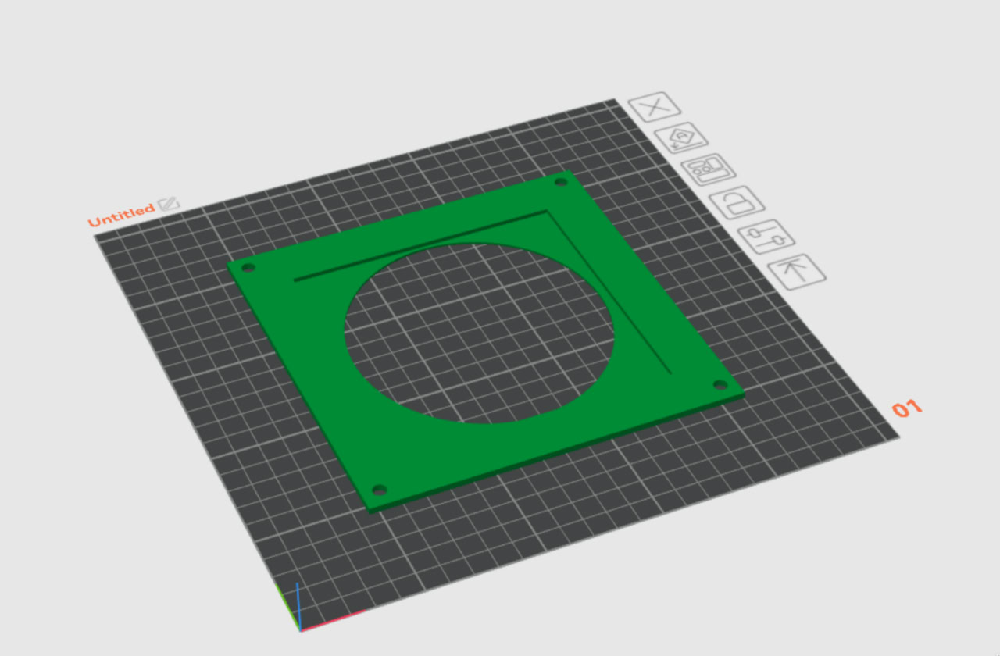
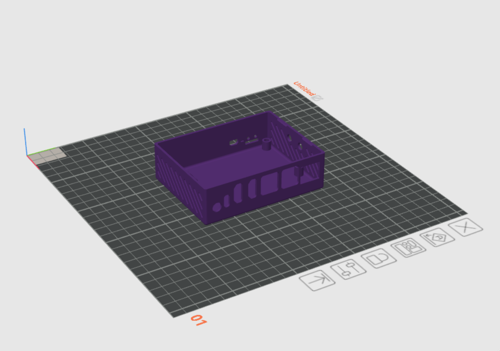
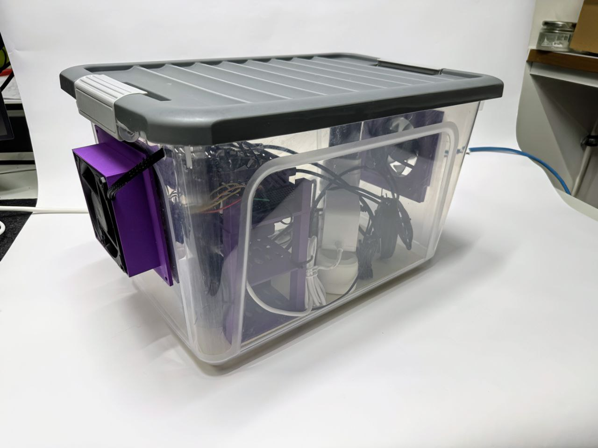

# Opencca-Box

This repository contains 3d models for OpenCCA.

1. [Stackable Shelf](#StackableShelf)
2. [Fan Mount](#FanMount)
3. [Rock 5B Case](#Rock5BCase)
4. [Raspberry Pi 5 Case](#RaspberryPi5Case)
5. [Raspberry Pi 3 Case](#RaspberryPi3Case)
5. [Pictures](#pictures)

### 1. Stackable Shelf

> "Small Stackable Shelf" by DamianB2, MakerWorld, licensed under the Standard Digital File License.

The Standard Digital File License forbids re-upload of the model file. Download the file at and change dimensions as follows:

https://makerworld.com/en/models/836617-small-stackable-shelfb

**160x80x70mm**

### 2. Fan Mount

3D Models for 80 mm fans (inner and outer piece)

> Original model: "80mm fan mount" by Mike Graham (Printables).  
> License: Creative Commons Attribution-NonCommercial 4.0 (CC BY-NC 4.0).  
> Source: https://www.printables.com/model/789175-80mm-fan-mount

Changes in this repo: Model was sliced to obtain inner piece and scaled for 80 and 120 mm.

<table>
  <tr>
    <td>
      
    </td>
    <td>
      
    </td>
  </tr>
</table>

Files: [./models/fan-mount](./models/fan-mount)

### 3. Rock 5B Case

> Author: ginger_space_ninja (Printables: @ginger_space_1730617)  
> Source: https://www.printables.com/model/780780-rock-5b-case  
> License: Creative Commons (4.0 International License)

We only used the bottom part, such that GPIO pins are still accessible.

https://www.printables.com/model/780780-rock-5b-case

Files: [./models/rock5b](./models/rock5b)

### 4. Raspberry Pi 5 Case

Pick a model that does not hide GPIO pins.

For instance, https://www.printables.com/model/653858-raspberry-pi-5-case/comments

### 5. Raspberry Pi 3 Case

Pick a model that does not hide GPIO pins.

### 6. Pictures

